The Impact of Drive Feature on Price Estimation Accuracy for Pre-Owned
Sedans and SUVs
================

**Problem Statement:**

My research focus will be on **“Does incorporating the drive feature
significantly enhance the accuracy of estimating the prices of pre-owned
Sedans and SUVs, as compared to using only the odometer, transmission,
type, and condition of the vehicles?”**

**Data Summary:**

The dataset consists of a comprehensive collection of 426,880 used
vehicles available for sale in the United States. It includes various
details such as the price, make and model, condition, technical
specifications, mileage, year of purchase, posting date, location
coordinates, and paint color.

For the analysis, we narrowed down the variables to seven essential
features. Among these, the drive feature has three categories:
rear-wheel drive (rwd), 4-wheel drive (4wd), and front-wheel drive
(fwd).

To begin, we filtered the dataset based on the year variable, focusing
on vehicles purchased between 2005 and 2020. We then specifically
selected data for sedans and SUVs from the type variable. Following
that, we eliminated missing values and outliers, resulting in a working
dataset of 56,651 used cars with five predictor variables and one
outcome variable. A summary of the statistical measures for these
variables is calculated, assuming minimum values for odometer and price.

Initially, the residuals of both models did not exhibit a normal
distribution. However, after applying a log transformation to the price
variable, the residuals of both models displayed a normal distribution,
as observed from the QQ plots.

``` r
knitr::opts_chunk$set(echo = TRUE)
library(dplyr)
library(tidyverse)
library(ggplot2)
library(knitr)
library(gridExtra) # For including grids of plots
library(psych)
library(ggiraph)
library(ggiraphExtra)
library(GGally)#for ggpairs
library(car)
```

``` r
# IMPORT DATASET
transport.data <- read_csv("vehicles.csv",col_types =cols(year = col_integer(),
  model = col_factor(),
  manufacturer = col_factor(),
  condition = col_factor(),
  cylinders = col_factor(),
  fuel = col_factor(),
  odometer = col_integer(),
  transmission = col_factor(),
  drive = col_factor(),
  size = col_factor(),
  type = col_factor(),
  paint_color = col_factor(),
  price = col_double()))

# Checking missing values
transport.data.missing <- transport.data %>% summarise_all(~ sum(is.na(.)))
#transport.data.missing

# filtering unusefull data from dataset
transport.data.select <- transport.data %>% select(year,condition,odometer,transmission,drive,type,price)
transport.data.sel <- transport.data.select %>% summarise_all(~ sum(is.na(.)))
transport.data.main <- na.omit(transport.data.select)
transport.data.main <- transport.data.main %>% filter(year>=2005,!year %in% c(2021,2022),odometer!=0,price!=0)
#summary(transport.data.main)

# WORKING DATASTET
car.data <- transport.data.main %>% filter(type %in% c("SUV","sedan"))
car.data <- car.data[,-c(1)] 
car.data.main <- car.data %>% filter(between(price,5000,50000),between(odometer,10000,200000)) %>% mutate(price=log(price)) #LOG of price to make residuals normally distributed

car.data.main %>% ggplot(aes(seq(odometer),odometer)) + geom_boxplot()
```

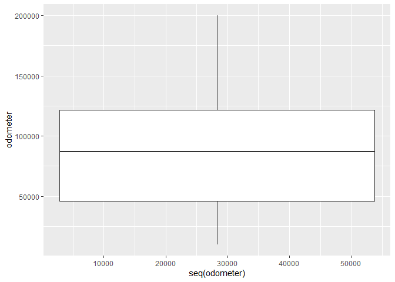<!-- -->

``` r
car.data.main %>% ggplot(aes(seq(price),price)) + geom_boxplot()
```

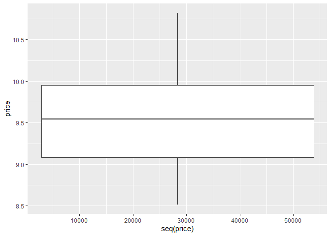<!-- -->

``` r
summary(car.data.main)
```

    ##      condition        odometer         transmission   drive      
    ##  good     :20914   Min.   : 10000   other    : 9114   rwd: 7812  
    ##  excellent:29660   1st Qu.: 46070   automatic:45980   4wd:22199  
    ##  fair     :  144   Median : 87014   manual   : 1557   fwd:26640  
    ##  like new : 5758   Mean   : 87109                                
    ##  new      :  138   3rd Qu.:121490                                
    ##  salvage  :   37   Max.   :200000                                
    ##                                                                  
    ##       type           price       
    ##  sedan  :30908   Min.   : 8.517  
    ##  SUV    :25743   1st Qu.: 9.083  
    ##  pickup :    0   Median : 9.543  
    ##  truck  :    0   Mean   : 9.533  
    ##  other  :    0   3rd Qu.: 9.952  
    ##  coupe  :    0   Max.   :10.820  
    ##  (Other):    0

``` r
car.data.main %>% ggplot(aes(odometer,price)) + geom_point() + geom_smooth(method = "lm")
```

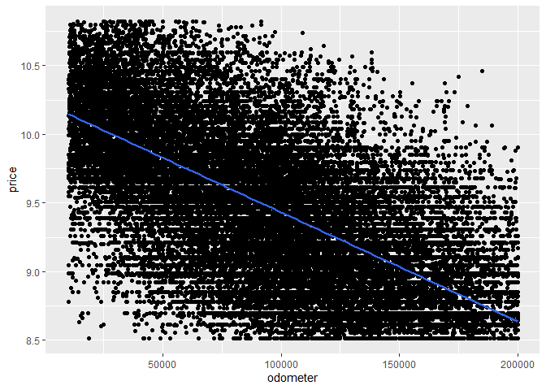<!-- -->

``` r
#Checking variable relations
ggpairs(car.data.main)
```

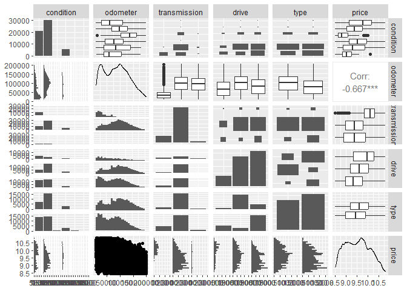<!-- -->

**Objective Plan**

To conduct the analysis, we constructed two multiple linear regression
models. **Model 1** included odometer, drive, transmission, type, and
condition as predictor variables, while **Model 2** included odometer,
transmission, type, and condition as predictor variables. The target
variable for both models was the price of used cars. Before running the
linear regression, we converted the categorical variables into dummy
variables (indicator variables). The default values for the features
were set as follows: drive - front-wheel drive (fwd), transmission -
other, type - sedan, and condition - salvage.

``` r
# DUMMY VARIABLES
car.data.main$type <- factor(car.data.main$type, levels = c("SUV","sedan"))

#transmission
car.data.main$transmission <- factor(car.data.main$transmission, levels = c("automatic","manual","other"))

automat_v_other <- c(1,0,0)
manual_v_other <- c(0,1,0)
contrasts(car.data.main$transmission) <- cbind(automat_v_other,manual_v_other)
contrasts(car.data.main$transmission)
```

    ##           automat_v_other manual_v_other
    ## automatic               1              0
    ## manual                  0              1
    ## other                   0              0

``` r
#type
SUV_v_sedan <- c(1,0)
contrasts(car.data.main$type) <- cbind(SUV_v_sedan)
contrasts(car.data.main$type)
```

    ##       SUV_v_sedan
    ## SUV             1
    ## sedan           0

``` r
#drive
rwd_v_fwd <- c(1,0,0)
x4wd_v_fwd <- c(0,1,0)
contrasts(car.data.main$drive) <- cbind(rwd_v_fwd,x4wd_v_fwd)
contrasts(car.data.main$drive)
```

    ##     rwd_v_fwd x4wd_v_fwd
    ## rwd         1          0
    ## 4wd         0          1
    ## fwd         0          0

``` r
#conditions
good_v_sal <- c(1,0,0,0,0,0)
excel_v_sal <- c(0,1,0,0,0,0)
fair_v_sal <- c(0,0,1,0,0,0)
lknew_v_sal <- c(0,0,0,1,0,0)
new_v_sal <- c(0,0,0,0,1,0)
contrasts(car.data.main$condition) <- cbind(good_v_sal,excel_v_sal,fair_v_sal,lknew_v_sal,new_v_sal)
contrasts(car.data.main$condition)
```

    ##           good_v_sal excel_v_sal fair_v_sal lknew_v_sal new_v_sal
    ## good               1           0          0           0         0
    ## excellent          0           1          0           0         0
    ## fair               0           0          1           0         0
    ## like new           0           0          0           1         0
    ## new                0           0          0           0         1
    ## salvage            0           0          0           0         0

Before running the model, we ensured that all predictor variables were
either categorical or quantitative, while the outcome variable was
quantitative, continuous, and without bounds. We also confirmed that the
predictor data exhibited variation in values, indicating non-zero
variance. Furthermore, we assumed that there were no external factors
influencing the predictor variables.

**MODEL 1 \< WITH DRIVE FEATURE\>**

``` r
# MULTIPLE LINEAR REG : MODEL 1 < WITH DRIVE FEATURE>
album.model <- lm(price ~ odometer+drive+transmission+type+condition, data = car.data.main)
```

**Assumption: MULTICOLLINEARITY**

In Model 1, we examined the maximum Variance Inflation Factor (VIF),
which was found to be less than 10. The average VIF value was close to
1, and the minimum tolerance exceeded the thresholds of 0.1 (considered
a serious problem) and 0.2 (considered a potential problem). Therefore,
we can conclude that there is no presence of multicollinearity in the
data.

``` r
# Assumptions checking

#Multicollinearity 
vif(album.model)
```

    ##                  GVIF Df GVIF^(1/(2*Df))
    ## odometer     1.333496  1        1.154771
    ## drive        1.653978  2        1.134051
    ## transmission 1.780213  2        1.155096
    ## type         1.605635  1        1.267136
    ## condition    1.501170  5        1.041461

``` r
tolerance = 1/vif(album.model)
tolerance
```

    ##                   GVIF  Df GVIF^(1/(2*Df))
    ## odometer     0.7499083 1.0       0.8659725
    ## drive        0.6046029 0.5       0.8817949
    ## transmission 0.5617304 0.5       0.8657290
    ## type         0.6228066 1.0       0.7891810
    ## condition    0.6661470 0.2       0.9601896

``` r
mean(vif(album.model)[11:15])
```

    ## [1] 1.150503

**Assumption: INDEPENDENCE**

For checking residuals are independent we use the Durbin-Watson test,
for Model 1 the values are close to 2. So no autocorrelation among
residuals and the assumption of independence is met.

``` r
# Assumptions checking

#independence
durbinWatsonTest(album.model)
```

    ##  lag Autocorrelation D-W Statistic p-value
    ##    1       0.1523742      1.695234       0
    ##  Alternative hypothesis: rho != 0

**Assumption: Homoscedacity and Linearity and Normality**

The residuals in Model 1 is linear but is heteroscedastic as seen from
the residual vs fitted plot.

``` r
# Assumptions checking

#homoscedacity and linearity and normality
plot(album.model)
```

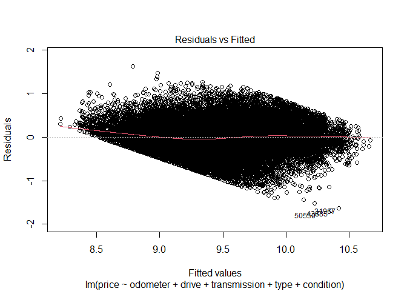<!-- -->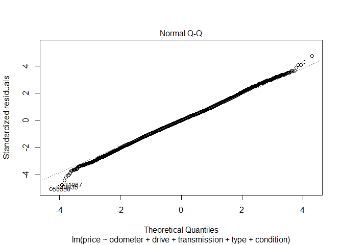<!-- -->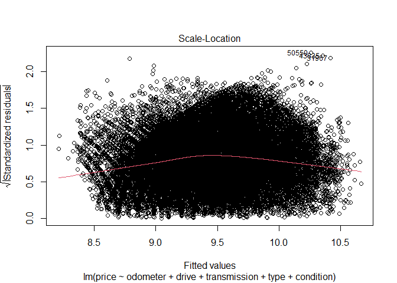<!-- -->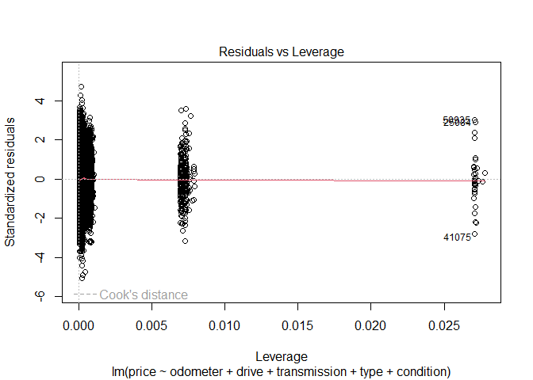<!-- -->

**Analysis: INFLUENTIAL POINTS**

To identify influential cases, we calculated Cook’s distance for both
models. The maximum value obtained for Model 1 was significantly
below 1. Based on this analysis, we can conclude that there are no
influential cases in Model 1.

``` r
# Assumptions checking

#checking influence points
car.data.main1 <- car.data.main
car.data.main1$cd <- cooks.distance(album.model)
plot(sort(car.data.main1$cd , decreasing=TRUE))
```

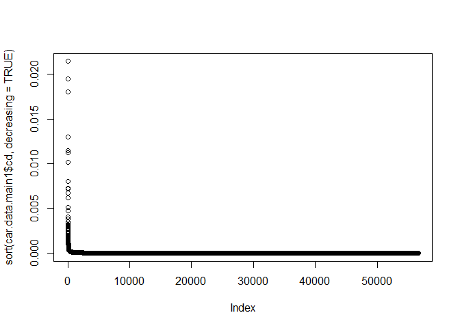<!-- -->

``` r
max(car.data.main1$cd)
```

    ## [1] 0.02143581

**Analysis: OUTLIERS CHECKING**

When examining the presence of outliers using standardized residuals
within a 95% range, we discovered that in Model 1, the residuals
represented 5.5% of observations that fell above or below 1.96 standard
deviations. However, none of these observations were considered
outliers.

``` r
# Assumptions checking

# outliers residual
car.data.main1$fitted <- album.model$fitted
car.data.main1$residuals <- album.model$residuals
car.data.main1$standardized.residuals <- rstandard(album.model)

possible.outliers1 <- subset(car.data.main1, standardized.residuals < -1.96 | standardized.residuals > 1.96)
#possible.outliers1
```

Now that we have checked all the assumptions of the linear model, we
will now check the model results:

In Model 1, all five predictor variables, including the intercept,
exhibited a significant influence on the price of used cars at a 5%
level of significance. The model achieved an R-squared value of 0.6126
and an adjusted R-squared value of 0.6125. This indicates that the
odometer, drive, transmission, type, and condition of the car
collectively explain 61.26% of the variance in the price of used SUVs
and sedans.

Specifically, for cars with rear-wheel drive (rwd), the price increased
by a factor of 0.364, and for cars with 4-wheel drive (4wd), the price
increased by a factor of 0.274, both with p-values less than 0.01. The
estimate for front-wheel drive (fwd) is accounted for by the intercept
of the model.

The model coefficients and their corresponding 95% confidence intervals
provide additional information on the relationship between the predictor
variables and the price of used cars which is stated below.

``` r
summary(album.model)
```

    ## 
    ## Call:
    ## lm(formula = price ~ odometer + drive + transmission + type + 
    ##     condition, data = car.data.main)
    ## 
    ## Residuals:
    ##      Min       1Q   Median       3Q      Max 
    ## -1.74310 -0.22473  0.00162  0.22101  1.63046 
    ## 
    ## Coefficients:
    ##                               Estimate Std. Error  t value Pr(>|t|)    
    ## (Intercept)                  9.719e+00  5.679e-02  171.152  < 2e-16 ***
    ## odometer                    -7.579e-06  3.596e-08 -210.769  < 2e-16 ***
    ## driverwd_v_fwd               3.641e-01  4.474e-03   81.378  < 2e-16 ***
    ## drivex4wd_v_fwd              2.736e-01  3.855e-03   70.973  < 2e-16 ***
    ## transmissionautomat_v_other -2.968e-01  5.243e-03  -56.609  < 2e-16 ***
    ## transmissionmanual_v_other  -2.942e-01  1.001e-02  -29.383  < 2e-16 ***
    ## typeSUV_v_sedan              2.122e-01  3.679e-03   57.683  < 2e-16 ***
    ## conditiongood_v_sal          4.551e-01  5.667e-02    8.031 9.84e-16 ***
    ## conditionexcel_v_sal         4.773e-01  5.662e-02    8.431  < 2e-16 ***
    ## conditionfair_v_sal          1.912e-01  6.346e-02    3.013  0.00259 ** 
    ## conditionlknew_v_sal         4.928e-01  5.676e-02    8.683  < 2e-16 ***
    ## conditionnew_v_sal           4.060e-01  6.371e-02    6.373 1.87e-10 ***
    ## ---
    ## Signif. codes:  0 '***' 0.001 '**' 0.01 '*' 0.05 '.' 0.1 ' ' 1
    ## 
    ## Residual standard error: 0.3441 on 56639 degrees of freedom
    ## Multiple R-squared:  0.6126, Adjusted R-squared:  0.6125 
    ## F-statistic:  8141 on 11 and 56639 DF,  p-value: < 2.2e-16

CONFIDENCE INTERVALS:

``` r
#confidence interval of MODEL 1
confint(album.model)
```

    ##                                     2.5 %        97.5 %
    ## (Intercept)                  9.608056e+00  9.830665e+00
    ## odometer                    -7.649814e-06 -7.508849e-06
    ## driverwd_v_fwd               3.553093e-01  3.728471e-01
    ## drivex4wd_v_fwd              2.660758e-01  2.811892e-01
    ## transmissionautomat_v_other -3.070969e-01 -2.865431e-01
    ## transmissionmanual_v_other  -3.138064e-01 -2.745595e-01
    ## typeSUV_v_sedan              2.050249e-01  2.194481e-01
    ## conditiongood_v_sal          3.440346e-01  5.661698e-01
    ## conditionexcel_v_sal         3.663372e-01  5.882688e-01
    ## conditionfair_v_sal          6.679068e-02  3.155482e-01
    ## conditionlknew_v_sal         3.815743e-01  6.040591e-01
    ## conditionnew_v_sal           2.811589e-01  5.309027e-01

**MODEL 2 \< WITHOUT DRIVE FEATURE\>**

``` r
# MULTIPLE LINEAR REG : MODEL 2 < WITHOUT DRIVE FEATURE>
album2.model <- lm(price ~ odometer+transmission+type+condition, data = car.data.main)
```

**Assumption: MULTICOLLINEARITY**

In Model 2, we examined the maximum Variance Inflation Factor (VIF),
which was found to be less than 10. The average VIF value was close to
1, and the minimum tolerance exceeded the thresholds of 0.1 (considered
a serious problem) and 0.2 (considered a potential problem). Therefore,
we can conclude that there is no presence of multicollinearity in the
data.

``` r
# Assumptions CHECKING

#Multicolinearity 
vif(album2.model)
```

    ##                  GVIF Df GVIF^(1/(2*Df))
    ## odometer     1.329868  1        1.153199
    ## transmission 1.761941  2        1.152120
    ## type         1.060933  1        1.030016
    ## condition    1.489233  5        1.040630

``` r
tolerance = 1/vif(album2.model)
tolerance
```

    ##                   GVIF  Df GVIF^(1/(2*Df))
    ## odometer     0.7519542 1.0       0.8671529
    ## transmission 0.5675558 0.5       0.8679648
    ## type         0.9425662 1.0       0.9708585
    ## condition    0.6714864 0.2       0.9609565

``` r
mean(vif(album2.model)[9:12])
```

    ## [1] 1.093991

**Assumption: INDEPENDENCE**

For checking residuals are independent we use the Durbin-Watson test,
for Model 2 the values are close to 2. So no autocorrelation among
residuals and the assumption of independence is met.

``` r
# Assumptions CHECKING

#independence
durbinWatsonTest(album2.model)
```

    ##  lag Autocorrelation D-W Statistic p-value
    ##    1       0.1559615      1.688071       0
    ##  Alternative hypothesis: rho != 0

**Assumption: Homoscedacity and Linearity and Normality**

The residuals in Model 2 is linear but is heteroscedastic as seen from
the residual vs fitted plot.

``` r
# Assumptions CHECKING

#homoscedacity and linearity and normality
plot(album2.model)
```

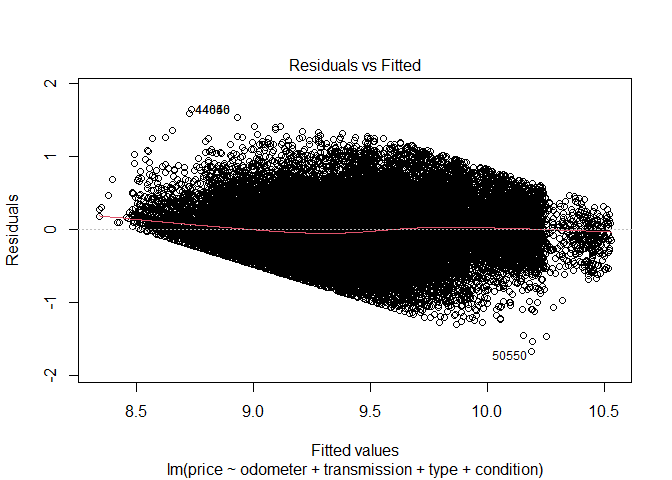<!-- -->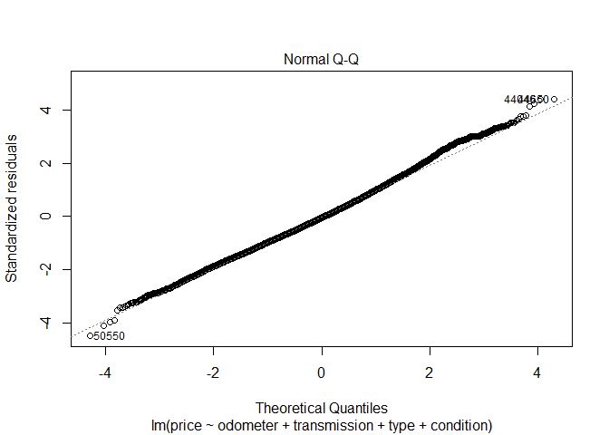<!-- -->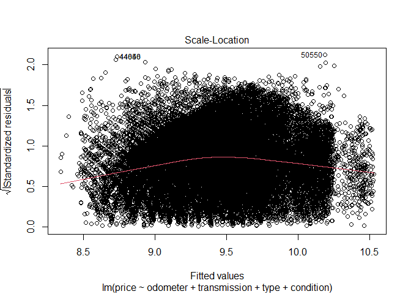<!-- -->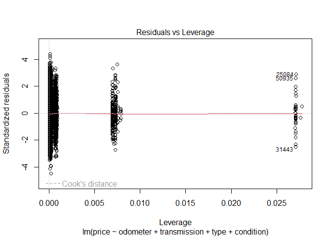<!-- -->

**Analysis: INFLUENTIAL POINTS**

To identify influential cases, we calculated Cook’s distance for both
models. The maximum value obtained for Model 2 was significantly
below 1. Based on this analysis, we can conclude that there are no
influential cases in Model 2.

``` r
# Assumptions CHECKING

#checking influence points
car.data.main2 <- car.data.main
car.data.main2$cd <- cooks.distance(album2.model)
plot(sort(car.data.main2$cd , decreasing=TRUE))
```

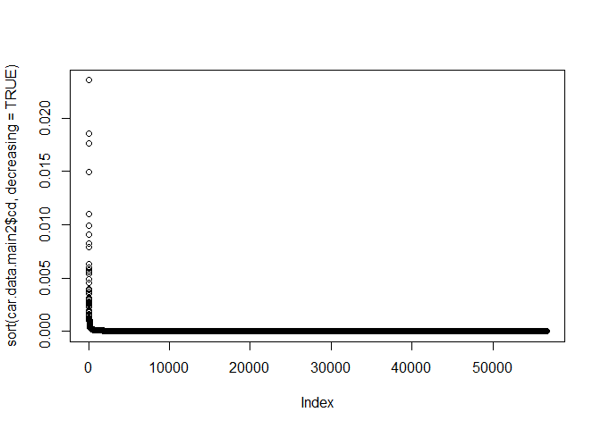<!-- -->

``` r
max(car.data.main2$cd)
```

    ## [1] 0.02353353

**Analysis: OUTLIERS CHECKING**

When examining the presence of outliers using standardized residuals
within a 95% range, we discovered that in Model 2, the residuals
accounted for 5.1% of observations outside this range. However, none of
these observations were considered outliers.

``` r
# Assumptions CHECKING

# outliers residual
car.data.main2$fitted <- album2.model$fitted
car.data.main2$residuals <- album2.model$residuals
car.data.main2$standardized.residuals <- rstandard(album2.model)

possible.outliers2 <- subset(car.data.main2, standardized.residuals < -1.96 | standardized.residuals > 1.96)
#possible.outliers2
```

Now that we have checked all the assumptions of the linear model, we
will now check the model results:

In Model 2, all four predictor variables, along with the intercept,
demonstrate a significant influence on the price of used cars at a 5%
level of significance. The model achieved an R-squared value of 0.5465
and an adjusted R-squared value of 0.5464. This indicates that the
odometer, transmission, type, and condition of the car collectively
explain 54.65% of the variance in the price of used SUVs and sedans.

The regression coefficients and their corresponding 95% confidence
intervals, offer further insights into the relationships between the
predictor variables and the price of used cars as stated bellow.

``` r
summary(album2.model)
```

    ## 
    ## Call:
    ## lm(formula = price ~ odometer + transmission + type + condition, 
    ##     data = car.data.main)
    ## 
    ## Residuals:
    ##      Min       1Q   Median       3Q      Max 
    ## -1.67309 -0.25495 -0.01844  0.23223  1.64012 
    ## 
    ## Coefficients:
    ##                               Estimate Std. Error  t value Pr(>|t|)    
    ## (Intercept)                  9.807e+00  6.143e-02  159.647  < 2e-16 ***
    ## odometer                    -7.481e-06  3.885e-08 -192.550  < 2e-16 ***
    ## transmissionautomat_v_other -3.133e-01  5.655e-03  -55.405  < 2e-16 ***
    ## transmissionmanual_v_other  -3.093e-01  1.079e-02  -28.677  < 2e-16 ***
    ## typeSUV_v_sedan              3.150e-01  3.236e-03   97.349  < 2e-16 ***
    ## conditiongood_v_sal          4.830e-01  6.131e-02    7.878 3.39e-15 ***
    ## conditionexcel_v_sal         5.060e-01  6.125e-02    8.261  < 2e-16 ***
    ## conditionfair_v_sal          2.345e-01  6.865e-02    3.416 0.000637 ***
    ## conditionlknew_v_sal         5.207e-01  6.140e-02    8.480  < 2e-16 ***
    ## conditionnew_v_sal           4.271e-01  6.893e-02    6.196 5.82e-10 ***
    ## ---
    ## Signif. codes:  0 '***' 0.001 '**' 0.01 '*' 0.05 '.' 0.1 ' ' 1
    ## 
    ## Residual standard error: 0.3723 on 56641 degrees of freedom
    ## Multiple R-squared:  0.5465, Adjusted R-squared:  0.5464 
    ## F-statistic:  7584 on 9 and 56641 DF,  p-value: < 2.2e-16

CONFIDENCE INTERVALS:

``` r
# Confidence Interval MODEL 2
confint(album2.model)
```

    ##                                     2.5 %        97.5 %
    ## (Intercept)                  9.686642e+00  9.927446e+00
    ## odometer                    -7.557267e-06 -7.404964e-06
    ## transmissionautomat_v_other -3.244203e-01 -3.022511e-01
    ## transmissionmanual_v_other  -3.304647e-01 -2.881812e-01
    ## typeSUV_v_sedan              3.086603e-01  3.213447e-01
    ## conditiongood_v_sal          3.628016e-01  6.031226e-01
    ## conditionexcel_v_sal         3.859664e-01  6.260718e-01
    ## conditionfair_v_sal          9.993436e-02  3.690592e-01
    ## conditionlknew_v_sal         4.003284e-01  6.410327e-01
    ## conditionnew_v_sal           2.919904e-01  5.621859e-01

**ANOVA: MODEL COMPARISION**

To compare the two models, we conducted an analysis of variance (ANOVA)
test. The results indicated a degree of freedom (Df) of -2 and a p-value
of less than 0.001. This suggests that the more complex Model 1, which
includes the drive feature, outperforms the less complex Model 2.
Therefore, we can conclude that Model 1 demonstrates a significant
improvement over Model 2 at a 5% level of significance.

``` r
# model comparison: ANOVA 
anova(album.model,album2.model)
```

    ## Analysis of Variance Table
    ## 
    ## Model 1: price ~ odometer + drive + transmission + type + condition
    ## Model 2: price ~ odometer + transmission + type + condition
    ##   Res.Df    RSS Df Sum of Sq      F    Pr(>F)    
    ## 1  56639 6707.1                                  
    ## 2  56641 7851.1 -2     -1144 4830.1 < 2.2e-16 ***
    ## ---
    ## Signif. codes:  0 '***' 0.001 '**' 0.01 '*' 0.05 '.' 0.1 ' ' 1

**Conclusion**

We constructed two multiple linear regression models to analyze the
impact of including or excluding the drive feature on the predicted
price of used SUVs and sedans. The default features in both models were
mileage, transmission, type, and condition of the cars. While most
assumptions of linear models were satisfied, we observed violation of
the homoscedasticity assumption in the residuals.

Comparing the two models, we found that Model 1, which incorporated the
drive feature, explained an additional 6% variance in car prices
compared to Model 2, which did not include this feature. The ANOVA test
confirmed that retaining the drive feature in the model yielded better
results than excluding it.

It is important to note that these models may not be reliable for
accurate price predictions due to the violation of certain assumptions.
To improve predictions, options include enhancing the dataset quality or
exploring alternative models.

In summary, adding the drive feature significantly improved the model’s
ability to predict the price of used SUVs and sedans. However, caution
should be exercised as the violated assumptions may impact the
reliability of the models.
